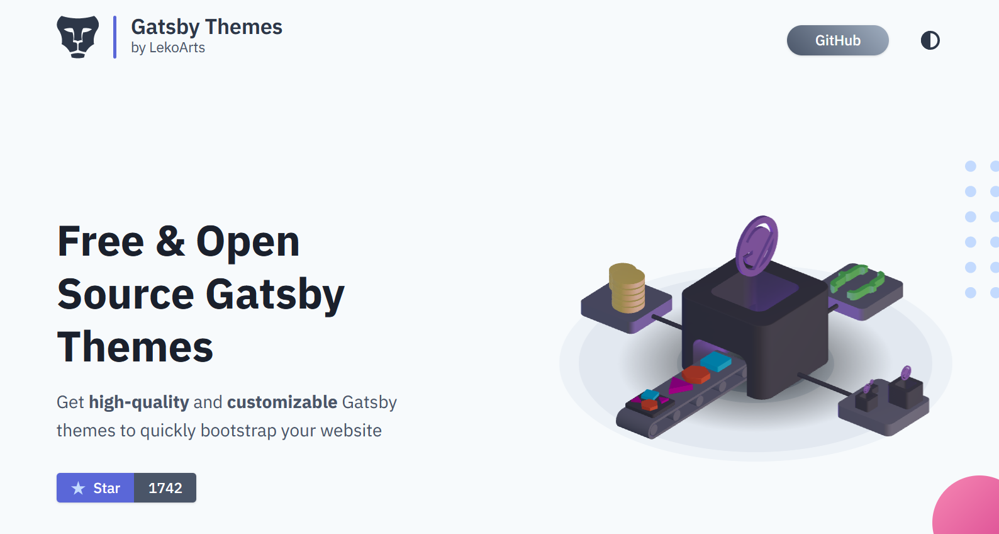
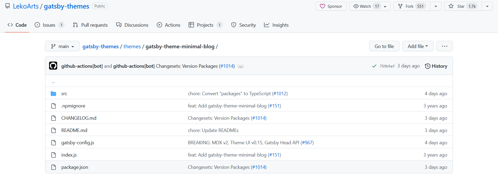
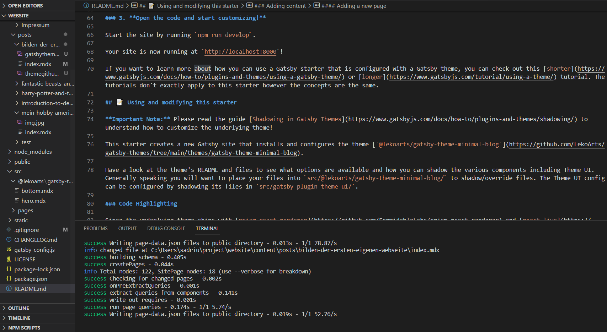
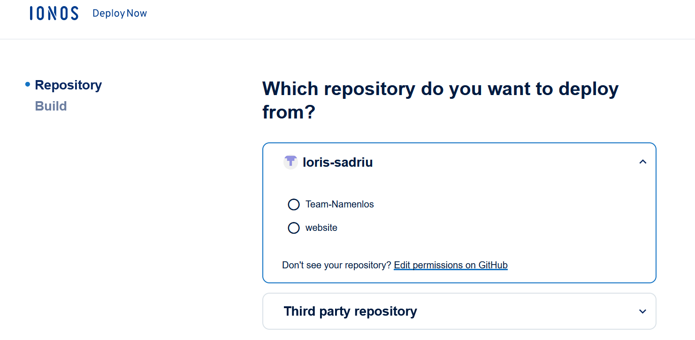

### Auswahl des Designs und Framework

Aufgrund dessen, dass sich meine Erfahrungen in Design und Framework in Grenzen halten, war ich dahingehend sehr flexibel. 
Nach einiger Zeit an Recherche habe ich mich entschieden ein bestehendes Design von [LekoArts](https://themes.lekoarts.de/) mit dem Framework [Gatsby](https://www.gatsbyjs.com/) zu nutzen und diesen meinen Wünschen entsprechend anzupassen.
Bevor ich mich aber an das Building gesetzt habe, machte ich mich erstmal vertraut mit [Gatsby](https://www.gatsbyjs.com/), um ein gewisses Gefühl der Möglichkeiten zu erlangen. 
Nachdem das erledigt war, legte ich mir auf Github ein Repository ein und holte mir das bestehende Theme.

### Design Anpassungen

Um das Design richtig anzupassen, las ich mich im bestehenden Code ein, um die verschiedenen Funktionalitäten zu verstehen und um das Verständnis von Gatsby zu vertiefen.
Dabei machte ich einige Tests, probierte mich aus und nutzte Dokumentationen. Nach der Einfindungsphase machte ich mir Gedanken, wie die Webseite strukturiert sein soll und welche Informationen zu finden sein sollen.
Daraufhin traute ich mich immer größere Anpassungen zu machen und tiefer einzudringen, bis ich schlussendlich mit dem Design und der Struktur zufrieden gestellt war.
Die vollzogenen Änderungen habe ich kleinschrittig in mein Repository gepushed und aussagekräftig dokumentiert, sodass rückblickend Änderungen immer nachvollzogen werden können.

### Building und einrichten eines Namesservers
Auch hier wurde Zeit in die Recherche investiert und ich habe mich aufgrund der einfachen Handhabung für [Ionos Deploy Now](https://www.ionos.de/hosting/webhosting?ac=OM.PU.PU287K417295T7073a&itc=UVB7NE9J-1J1XUL-&utm_source=google&utm_medium=cpc&utm_campaign=SBG-DE-CLA-WHOS------&utm_term=ionos%20webhosting&matchtype=p&utm_content=IONOS+Hosting&gclid=Cj0KCQjw1vSZBhDuARIsAKZlijROLn_-DMQ7Dc0QF25DWPVh1nkG--Ym4ok-tPLj6SFc50LnTp3eaf0aAtcwEALw_wcB&gclsrc=aw.ds
) entschieden, welche die Webseiten direkt aus dem Github Repository buildet. [Ionos Deploy Now](https://www.ionos.de/hosting/webhosting?ac=OM.PU.PU287K417295T7073a&itc=UVB7NE9J-1J1XUL-&utm_source=google&utm_medium=cpc&utm_campaign=SBG-DE-CLA-WHOS------&utm_term=ionos%20webhosting&matchtype=p&utm_content=IONOS+Hosting&gclid=Cj0KCQjw1vSZBhDuARIsAKZlijROLn_-DMQ7Dc0QF25DWPVh1nkG--Ym4ok-tPLj6SFc50LnTp3eaf0aAtcwEALw_wcB&gclsrc=aw.ds)
 ist auch ohne große Dokumentation und Anleitung sehr einfach zu bedienen und mit 4€/Monat eine kostengünstige Alternative Webseiten zu builden. 
 Eine Domain und ein Nameserver kann hier ebenfalls erworben werden und nach einrichten des Nameservers stand der Webseite somit nichts mehr im Weg.

Klicke [hier](https://github.com/loris-sadriu) um zu meinem Github Repository zu gelangen und einen tieferen Einblick zu bekommen.
