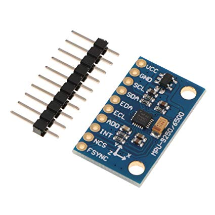
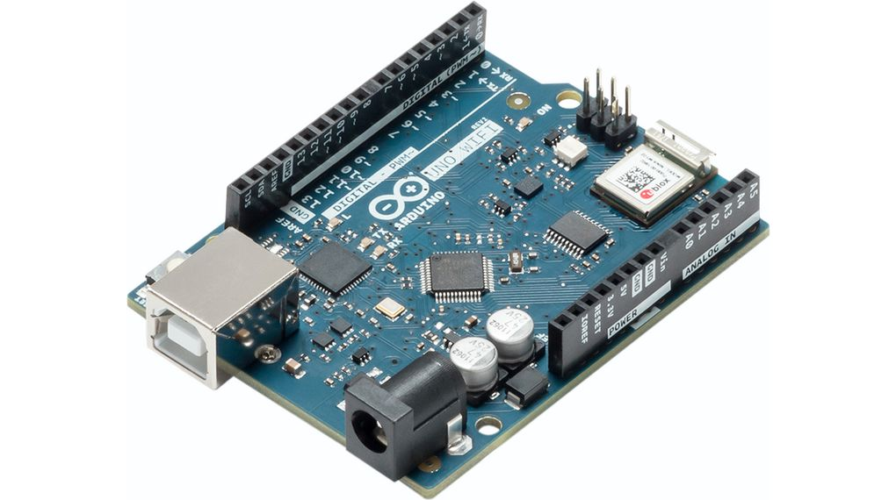
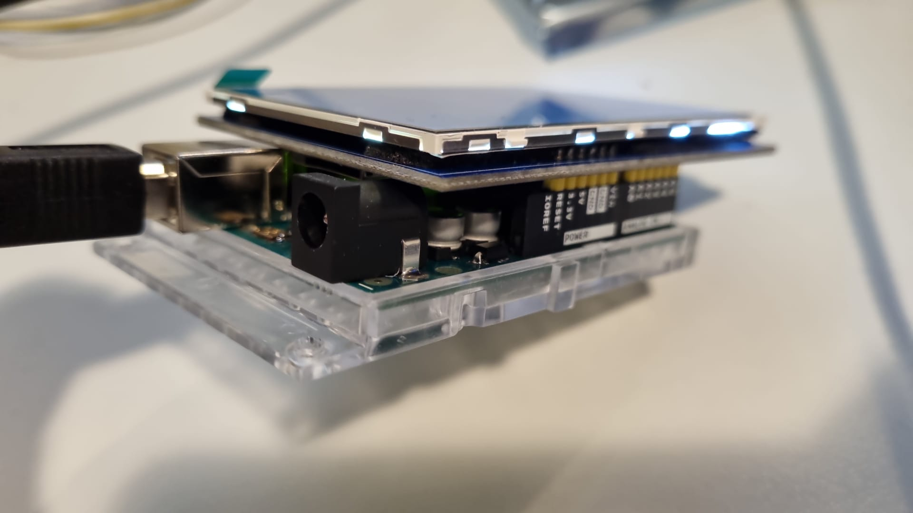

### Idee

Ein guter Freund hat sich vorgenommen sein Motorrad um einen externen Geschwindigkeitsmesser mit einem integrierten Bildschirm zu modifizieren.
Auf dem Bildschirm soll die Höchstgeschwindigkeit, Durchschnittsgeschwindigkeit, maximale Beschleunigung und je nach Aufwand, andere Werte wie zum Beispiel die Rundenzeit angezeigt werden.
Dieses Projekt wird in Zusammenarbeit mit meinem Freund gemacht und er stellt es an seiner Hochschule vor.

### Hardware

Hierfür wurde Zeit in die Recherche und Planung investiert. Dabei sind wir auf die Kombination Gyrosensor mit einem Arduino gestoßen.
Durch Löten der Steckverbindungen und gewissen Anpassungen, konnte man sich die ersten Testergebnisse auf einem Bildschirm anzeigen lassen.
Des Weiteren wurde noch ein kleiner LCD-Monitor besorgt, um in der Zukunft die gewünschten Daten gesondert auf dem Motorrad befestigt betrachten zu können.

Der Bildschirm ließ sich auch problemlos mit dem Arduino verbinden und das Thema Hardware ist erstmal erledigt.

### Planung der Software

Das Projekt ist noch weiterhin im Gange und die finale Planung wurde noch nicht unternommen, allerdings existiert bereits ein grober Fahrplan.
Eine Datenbank mit mindestens zwei Tabellen ist nötig, wobei es aus technischen Gründen denkbar ist, die Informationen auf mehrere Tabellen zu verteilen.
In diesem Beispiel stellen wir uns vor, dass die eine Tabelle mit allen kommenden Daten temporär - und die andere anhand unserer Logik gefüllt wird.
Hierbei wird auch klar, dass unser Code nicht nur die passende Logik braucht, sondern auch einen entsprechenden Datenbankzugriff, um die Tabellenspalten zu füllen.
Diese zweite Tabelle muss auch immer wieder anhand der neuen Daten aktualisiert werden und auf dem Bildschirm zu sehen sein.

Bei Abschluss des Projektes erfolgt ein finales Update.

