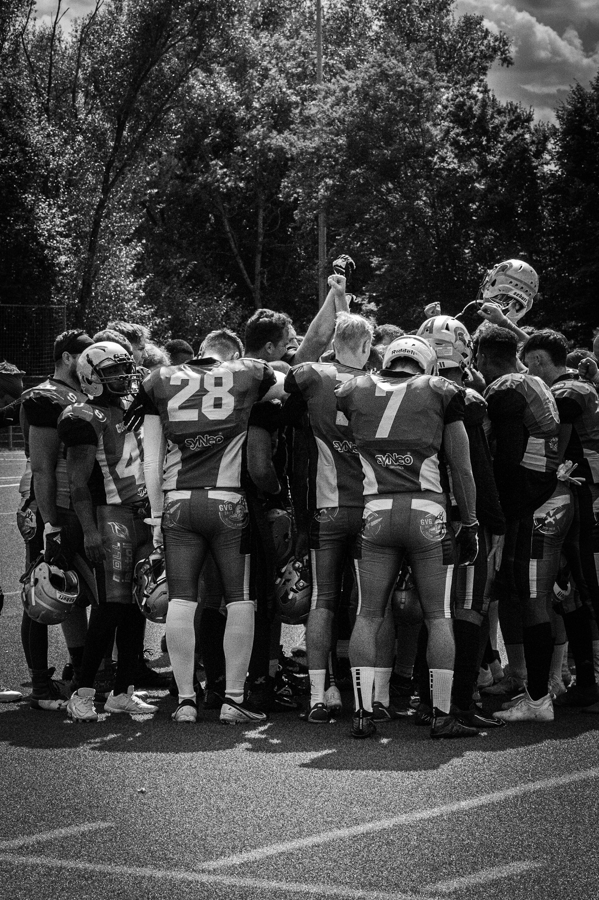

American Football (englisch für „Amerikanischer Fußball“), oder auch kurz Football, ist eine aus den Vereinigten Staaten stammende Ballsportart[...]. ([Wikipedia](https://de.wikipedia.org/wiki/American_Football))

[Grundregeln des American Football](https://www.youtube.com/watch?v=QIjVePrc2O8)

Aber was macht Football wirklich aus? - Ganz einfach: das Team. Im American Football ist ein Alleingang eines einzelnen Spielers unmöglich und das Zusammenspiel eines funktionierenden Teams unerlässlich. In vielen Momenten muss man seinem Nebenmann blind vertrauen und das ist nur mit einem starken Teamgefüge möglich. 

Allerdings werden Spiele nicht nur mit einem großartigen Team gewonnen, sondern auch die richtige Taktik ist spielentscheidend. Von außen betrachtet wirkt das für den Laien schnell wie ein Hühnerhaufen die aufeinander losgehen, jedoch bewegt sich jeder Spieler so wie es für den Spielzug vorgesehen wurde und damit entwickelt sich Football zu einer wirklichen Merkarbeit, da ein Playbook schnell über 50 Seiten erreicht.

Selber verfolgt habe ich die Sportart schon Jahre bevor ich selber begonnen habe zu spielen, aber als ich bei den [Albershausen Crusaders](https://albershausen-crusaders.de/) meine eigenen Erfahrungen sammeln konnte und mich in das Team eingefunden habe, lernte ich diesen Sport zu lieben.

